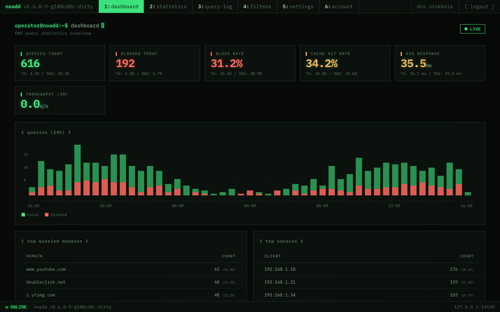
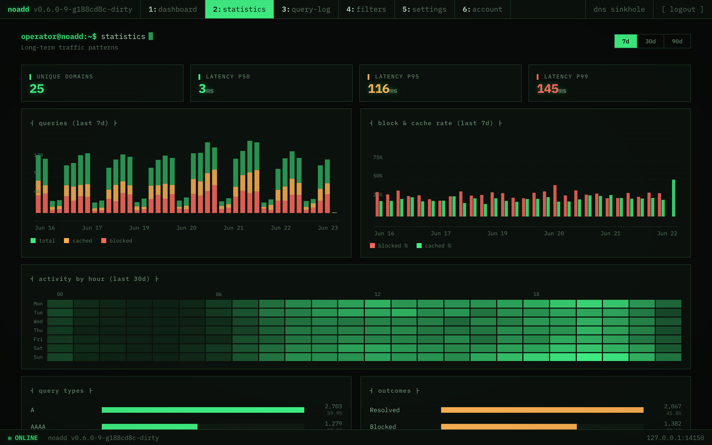
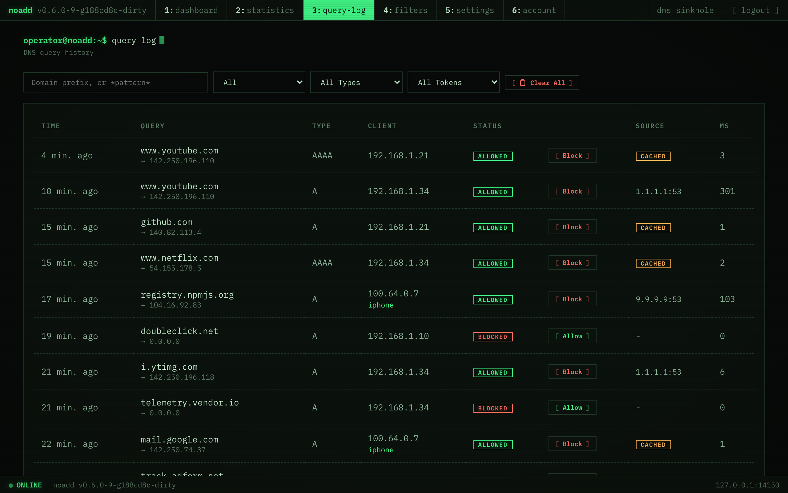
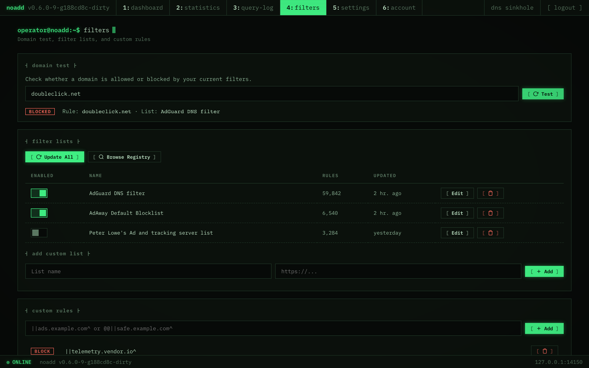
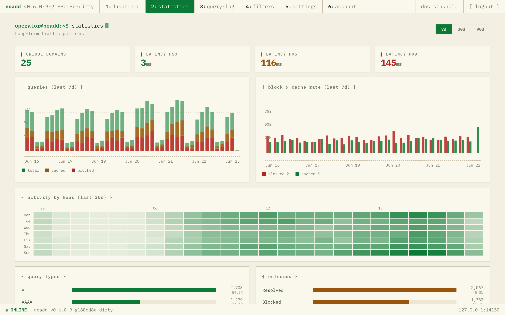
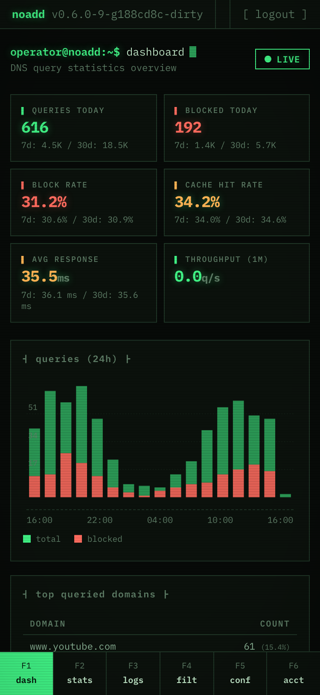
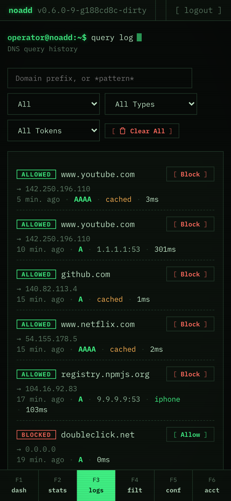

# noadd

[](https://github.com/henry40408/noadd/actions/workflows/ci.yml)
[](LICENSE.txt)
[](https://www.rust-lang.org/)
[](https://ghcr.io/henry40408/noadd)
[](https://casuallymaintained.tech/)

A self-hosted DNS ad-blocker with DNS-over-HTTPS support, built in Rust.

Blocks ads and trackers at the DNS level using community-maintained filter lists. Ships as a single binary with an embedded web admin UI.

## Features

- **Plain DNS** (UDP + TCP, port 53) and **DNS-over-HTTPS** (RFC 8484)
- **Filter engine** with FST + flat trie — 390K rules in ~7 MB RAM (~19 bytes/rule), 50K+ QPS
- **Built-in filter lists** — AdGuard DNS, EasyList, Peter Lowe's, OISD Basic, Steven Black, URLhaus
- **Custom rules** — unified API with auto-detection of block/allow syntax
- **Domain test** — check if a domain is allowed or blocked with matched rule details
- **Upstream DNS strategy** — Sequential, Round Robin, or Lowest Latency (EMA-based) with runtime switching
- **Admin web UI** — dashboard with live stats, statistics page (7d/30d/90d trends, weekday×hour heatmap, query type & result breakdowns, DB health), query log with quick Allow/Block actions, filter management
- **Mobile-friendly** — responsive layout with bottom tab navigation and card-based views
- **DoH token auth** — restrict DoH access with user-defined URL tokens (`/dns-query/my-token`)
- **Apple mobileconfig** — generate iOS/macOS DNS profiles for DoH tokens
- **TLS support** — manual certificates or automatic Let's Encrypt via ACME
- **SQLite storage** — config, query logs, and stats in a single file
- **Hot-swap filters** — update lists without restarting, zero query interruption
- **Low resident memory** — mimalloc allocator returns the filter-rebuild working set to the OS, keeping steady-state RSS low on small devices (e.g. Raspberry Pi)

## Screenshots

The admin UI is embedded in the binary — dark/light follows your OS preference, and the layout adapts to phones with a bottom tab bar.









<table>
  <tr>
    <td width="56%"></td>
    <td width="22%"></td>
    <td width="22%"></td>
  </tr>
  <tr>
    <td align="center">Light theme</td>
    <td align="center" colspan="2">Mobile layout with bottom tab bar</td>
  </tr>
</table>

## Quick Start

```bash
cargo build --release

# Start with default settings (DNS on 0.0.0.0:53, HTTP on 0.0.0.0:3000)
sudo ./target/release/noadd

# Or use custom ports (no root needed)
./target/release/noadd --dns-addr 127.0.0.1:5353 --http-addr 127.0.0.1:3000
```

Open `http://127.0.0.1:3000` to create your operator account (username + password) and access the dashboard. Additional operators and active sessions are managed from the Account page.

### Docker

```bash
docker run -d \
  --name noadd \
  -p 53:53/udp -p 53:53/tcp -p 3000:3000 \
  -v noadd-data:/data \
  ghcr.io/henry40408/noadd --db-path /data/noadd.db
```

## Usage

```
noadd [OPTIONS]

Options:
      --db-path <DB_PATH>            SQLite database path [default: noadd.db] [env: NOADD_DB_PATH]
      --dns-addr <DNS_ADDR>          DNS listener (UDP + TCP) [default: 0.0.0.0:53] [env: NOADD_DNS_ADDR]
      --http-addr <HTTP_ADDR>        HTTP/DoH listener [default: 0.0.0.0:3000] [env: NOADD_HTTP_ADDR]
      --tls-cert <TLS_CERT>          TLS certificate file [env: NOADD_TLS_CERT]
      --tls-key <TLS_KEY>            TLS private key file [env: NOADD_TLS_KEY]
      --acme-domain <ACME_DOMAIN>    Let's Encrypt domain(s), comma-separated [env: NOADD_ACME_DOMAIN]
      --acme-email <ACME_EMAIL>      Let's Encrypt contact email [env: NOADD_ACME_EMAIL]
      --acme-cache <ACME_CACHE>      ACME certificate cache directory [default: acme-cache] [env: NOADD_ACME_CACHE]
      --acme-prod                    Use Let's Encrypt production (default: staging) [env: NOADD_ACME_PROD]
  -h, --help                         Print help
```

## Testing DNS

```bash
# Plain DNS
dig @127.0.0.1 -p 5353 example.com A

# DNS-over-HTTPS (with token)
doggo example.com A @https://127.0.0.1:3000/dns-query/my-token

# Verify ad blocking
dig @127.0.0.1 -p 5353 ads.google.com A
# Expected: 0.0.0.0
```

## TLS Setup

### Manual certificates

```bash
mkcert -install
mkcert -cert-file cert.pem -key-file key.pem localhost 127.0.0.1

./target/release/noadd \
  --dns-addr 127.0.0.1:5353 \
  --http-addr 127.0.0.1:3443 \
  --tls-cert cert.pem \
  --tls-key key.pem
```

### Let's Encrypt (ACME)

```bash
./target/release/noadd \
  --http-addr 0.0.0.0:443 \
  --acme-domain dns.example.com \
  --acme-email you@example.com \
  --acme-prod
```

## Development

```bash
# Run tests
cargo nextest run

# Check formatting + lints
cargo fmt --check
cargo clippy -- -D warnings

# Run in dev mode
RUST_LOG=noadd=debug cargo run -- --dns-addr 127.0.0.1:5353 --http-addr 127.0.0.1:3000
```

### End-to-end tests

Browser-based BDD tests for the admin UI live in [`e2e/`](e2e/), built with
[playwright-bdd](https://github.com/vitalets/playwright-bdd). Playwright starts
the `noadd` binary itself (on throwaway ports and SQLite files), so build the
binary first:

```bash
cargo build                       # embeds the admin UI into the binary
cd e2e
npm ci
npx playwright install chromium
npm test                          # generates step bindings, then runs the suite
```

Gherkin features are in `e2e/features/`; step definitions in `e2e/steps/`. The
suite also runs in CI via the `e2e` job.

### Regenerating README screenshots

The images in `docs/screenshots/` are produced by a repeatable pipeline that
seeds a throwaway database with ~90 days of fake traffic, boots `noadd` on
throwaway ports, and re-captures every page with Playwright. Re-run it after
any admin-UI change and commit the updated PNGs:

```bash
cargo build                       # embeds the current admin UI into the binary
cd e2e
npm ci && npx playwright install chromium   # first time only
npm run screenshots
```

## License

MIT
