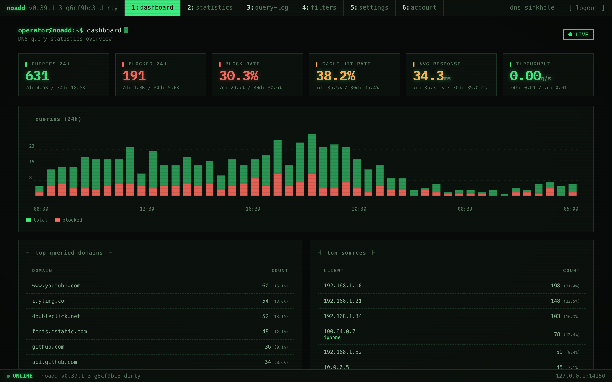
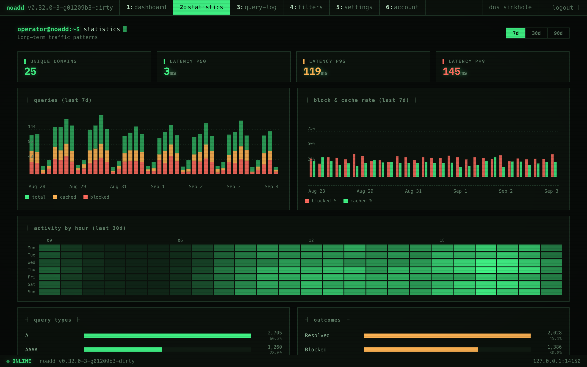
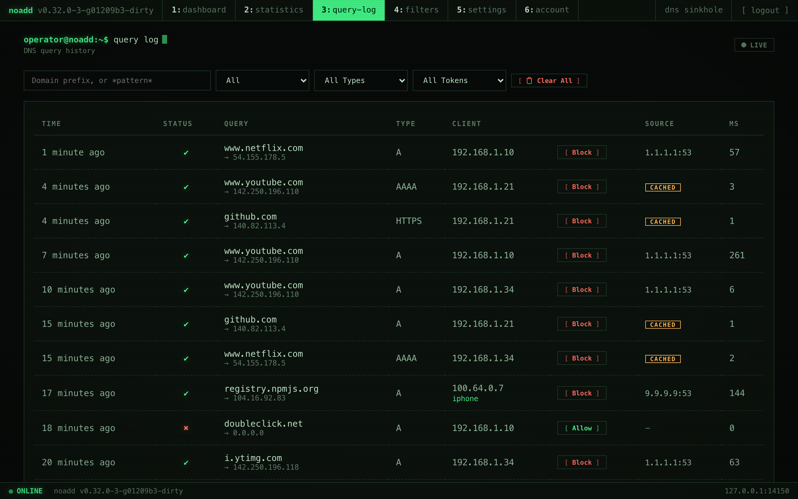
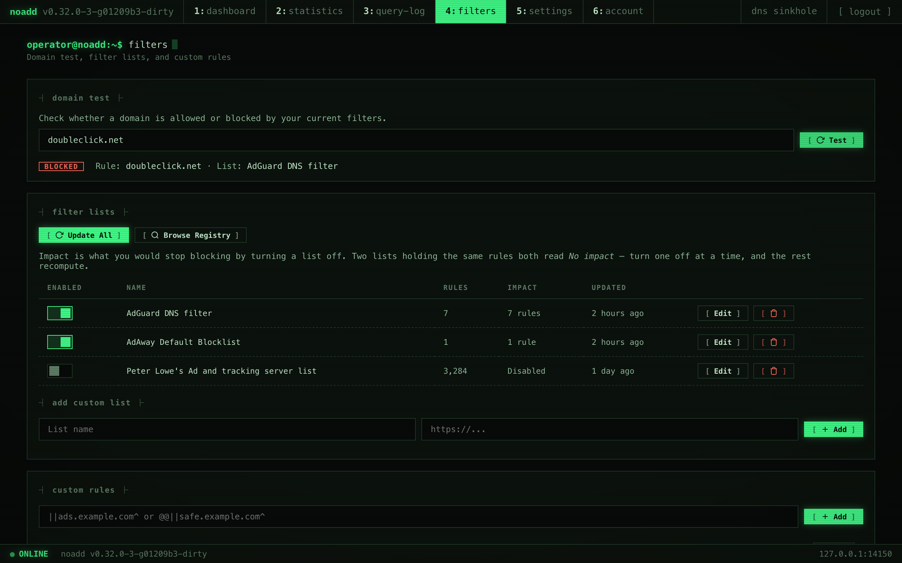
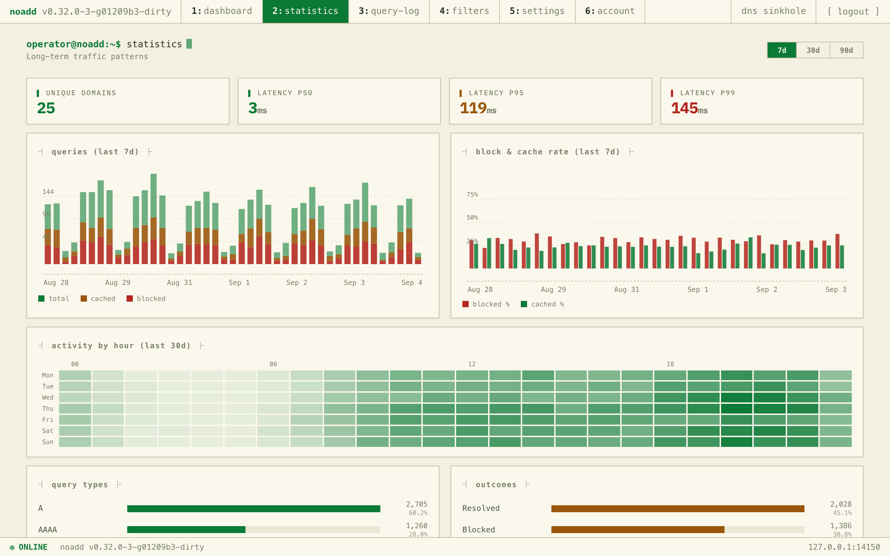
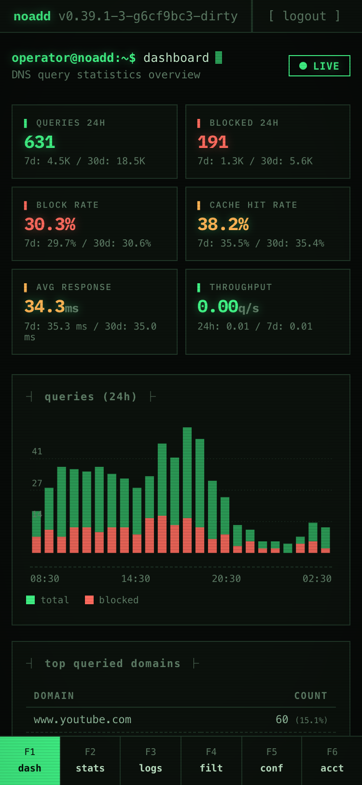
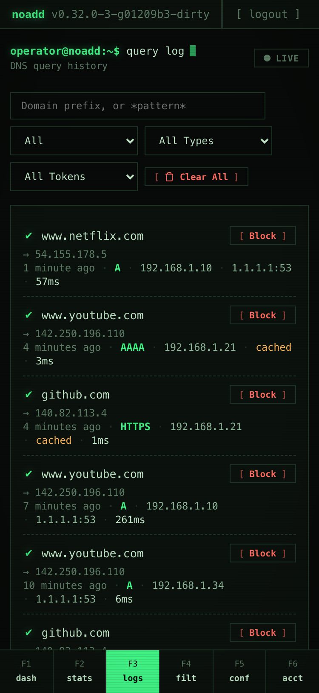

# noadd

> A self-hosted DNS ad-blocker with DNS-over-HTTPS support, built in Rust.

[](https://github.com/henry40408/noadd/actions/workflows/ci.yml)
[](https://codecov.io/gh/henry40408/noadd)
[](https://github.com/henry40408/noadd/releases/latest)
[](LICENSE.txt)
[](https://www.rust-lang.org/)
[](https://ghcr.io/henry40408/noadd)
[](https://casuallymaintained.tech/)
[](https://claude.com/claude-code)

Blocks ads and trackers at the DNS level using community-maintained filter lists. Ships as a single binary with an embedded web admin UI.

The admin UI is embedded in the binary — dark/light follows your OS preference, and the layout adapts to phones with a bottom tab bar. It is rendered on the server, so every page works with JavaScript disabled: signing in, changing settings, editing filters, paging and filtering the query log, adding operators and API keys. The charts and the log's live tail are the exceptions, and each says so where it sits rather than leaving a gap.









<table>
  <tr>
    <td width="56%"></td>
    <td width="22%"></td>
    <td width="22%"></td>
  </tr>
  <tr>
    <td align="center">Light theme</td>
    <td align="center" colspan="2">Mobile layout with bottom tab bar</td>
  </tr>
</table>

## Features

- **Plain DNS** (UDP + TCP, port 53) and **DNS-over-HTTPS** (RFC 8484)
- **Filter engine** with FST + flat trie — 390K rules in ~7 MB RAM (~19 bytes/rule), 50K+ QPS
- **Built-in filter lists** — AdGuard DNS, EasyList, Peter Lowe's, OISD Basic, Steven Black, URLhaus
- **Custom rules** — unified API with auto-detection of block/allow syntax
- **Domain test** — check if a domain is allowed or blocked with matched rule details
- **Configurable upstream DNS** — user-configurable at runtime (plain `ip[:port]`, port 53 assumed; DoT `tls://`; DoH `https://`), applied live on save with no restart; strategy (Sequential / Round Robin / Lowest Latency EMA) switchable independently
- **Configurable block response** — choose how blocked queries are answered: `0.0.0.0`/`::` (default), `NXDOMAIN`, `REFUSED`, or an operator-supplied custom IP for A/AAAA; runtime setting, applied live with no restart
- **Admin web UI** — dashboard with live stats, statistics page (7d/30d/90d trends, weekday×hour heatmap, query type & result breakdowns, DB health), query log with quick Allow/Block actions, filter management
- **Mobile-friendly** — responsive layout with bottom tab navigation and card-based views
- **DoH token auth** — restrict DoH access with user-defined URL tokens (`/dns-query/my-token`)
- **Apple mobileconfig** — generate iOS/macOS DNS profiles for DoH tokens
- **TLS support** — manual certificates or automatic Let's Encrypt via ACME
- **SQLite storage** — config, query logs, and stats in a single file
- **Hot-swap filters** — update lists without restarting, zero query interruption
- **DNSSEC transparency** — forces the DO (DNSSEC OK) bit on upstream queries, surfaces the upstream's Authenticated Data (AD) verdict as a badge in the query log, and tailors OPT/DNSSEC records to each client's original EDNS/DO profile (default on, toggle in Settings); full hop-by-hop protection requires a `tls://` upstream and DoH to devices
- **Low resident memory** — mimalloc allocator returns the filter-rebuild working set to the OS, keeping steady-state RSS low on small devices (e.g. Raspberry Pi)

## Out of Scope

noadd intentionally keeps a narrow focus. The following are **not** supported, and most are not currently planned:

- **Encrypted inbound DNS beyond DoH** — no DoT, DoQ, or DNSCrypt server. Clients connect over plain UDP/TCP or DoH. (DoT *is* supported for upstream forwarding via `tls://`.)
- **Local DNSSEC validation** — noadd surfaces the upstream's AD verdict (see Features) but does not verify signatures itself or return SERVFAIL on bogus answers. Trust is hop-by-hop.
- **Recursive resolution** — noadd is a forwarder, not a recursive resolver; it relies on configured upstreams rather than resolving from the root.
- **Per-client / per-device policies** — filtering and rules are global; there is no AdGuard-style per-client filtering.
- **Built-in MFA / passkeys** — the admin login is a password only. Put a proxy that does MFA in front and point noadd at it with `--forward-auth-header`; see [Multi-factor authentication](#multi-factor-authentication).
- **A separate listen address for the admin UI** — one HTTP listener serves both DoH and the admin UI. Restricting one without the other is a routing rule on the reverse proxy that publishes noadd; see [Publishing DoH without publishing the admin UI](#publishing-doh-without-publishing-the-admin-ui).

## Quick Start

```bash
cargo build --release

# Start with default settings (DNS on 0.0.0.0:53, HTTP on 127.0.0.1:8080)
sudo ./target/release/noadd

# Or use custom ports (no root needed)
./target/release/noadd --dns-addr 127.0.0.1:5353 --http-addr 127.0.0.1:8080
```

Open `http://127.0.0.1:8080` to create your operator account (username + password) and access the dashboard. Passwords must be 12–128 characters and are checked for guessability with [zxcvbn](https://github.com/shssoichiro/zxcvbn-rs) — noadd has no second factor yet, so the password is the whole defence. Common passwords, keyboard runs, and anything built from your own username are refused with a message saying why. Any characters are allowed, so a few unrelated words is the easy way to clear the bar. The check runs entirely offline; no password or hash ever leaves the box. Additional operators and active sessions are managed from the Account page.

### Docker

```bash
docker run -d \
  --name noadd \
  -p 53:53/udp -p 53:53/tcp -p 8080:8080 \
  -v noadd-data:/data \
  ghcr.io/henry40408/noadd
```

The container runs from `/data`, so the database is stored there as
`noadd.sqlite3`. Deployments created before this default carried a
`noadd.db` in the same volume; it is picked up automatically on upgrade
(rename it to `noadd.sqlite3` to silence the startup warning).

## Usage

```
noadd [OPTIONS]

Options:
      --db-path <DB_PATH>            SQLite database path [default: noadd.sqlite3] [env: NOADD_DB_PATH]
      --dns-addr <DNS_ADDR>          DNS listener (UDP + TCP) [default: 0.0.0.0:53] [env: NOADD_DNS_ADDR]
      --http-addr <HTTP_ADDR>        HTTP/DoH listener [default: 127.0.0.1:8080] [env: NOADD_HTTP_ADDR]
      --tls-cert <TLS_CERT>          TLS certificate file [env: NOADD_TLS_CERT]
      --tls-key <TLS_KEY>            TLS private key file [env: NOADD_TLS_KEY]
      --acme-domain <ACME_DOMAIN>    Let's Encrypt domain(s), comma-separated [env: NOADD_ACME_DOMAIN]
      --acme-email <ACME_EMAIL>      Let's Encrypt contact email [env: NOADD_ACME_EMAIL]
      --acme-cache <ACME_CACHE>      ACME certificate cache directory [default: acme-cache] [env: NOADD_ACME_CACHE]
      --acme-prod                    Use Let's Encrypt production (default: staging) [env: NOADD_ACME_PROD]
      --cookie-secure [<COOKIE_SECURE>]
                                     Set Secure on the admin session cookie [default: on when noadd
                                     terminates TLS] [env: NOADD_COOKIE_SECURE]
      --hsts [<HSTS>]                Send Strict-Transport-Security [default: on when noadd
                                     terminates TLS] [env: NOADD_HSTS]
      --hsts-max-age <HSTS_MAX_AGE>  max-age in seconds for Strict-Transport-Security
                                     [default: 31536000] [env: NOADD_HSTS_MAX_AGE]
      --log-format <LOG_FORMAT>      Diagnostic log format: full, compact, pretty, json
                                     [default: full] [env: LOG_FORMAT]
      --max-inflight-queries <MAX_INFLIGHT_QUERIES>
                                     Max concurrent in-flight DNS queries across UDP/TCP/DoH; 0
                                     disables [default: 2048] [env: NOADD_MAX_INFLIGHT_QUERIES]
      --rate-limit-qps <RATE_LIMIT_QPS>
                                     Per-client-IP steady-state query rate (queries/sec); 0 disables
                                     [default: 100] [env: NOADD_RATE_LIMIT_QPS]
      --rate-limit-burst <RATE_LIMIT_BURST>
                                     Per-client-IP burst allowance [default: 200]
                                     [env: NOADD_RATE_LIMIT_BURST]
      --log-query-results            Record the answer in the query log's result column, at the cost
                                     of an extra DNS-message parse per query
                                     [env: NOADD_LOG_QUERY_RESULTS]
      --trusted-proxies <TRUSTED_PROXIES>
                                     CIDRs of reverse-proxy hops permitted to set X-Forwarded-For /
                                     X-Real-IP [env: NOADD_TRUSTED_PROXIES]
      --forward-auth-header <FORWARD_AUTH_HEADER>
                                     Reverse-proxy username header, e.g. Remote-User [env: NOADD_FORWARD_AUTH_HEADER]
      --forward-auth-trusted-proxies <FORWARD_AUTH_TRUSTED_PROXIES>
                                     CIDRs allowed to set the forward-auth header [env: NOADD_FORWARD_AUTH_TRUSTED_PROXIES]
      --forward-auth-logout-url <FORWARD_AUTH_LOGOUT_URL>
                                     Proxy/SSO logout URL to send the browser to on logout [env: NOADD_FORWARD_AUTH_LOGOUT_URL]
  -h, --help                         Print help
```

## Testing DNS

```bash
# Plain DNS
dig @127.0.0.1 -p 5353 example.com A

# DNS-over-HTTPS (with token)
doggo example.com A @https://127.0.0.1:8080/dns-query/my-token

# Verify ad blocking
dig @127.0.0.1 -p 5353 ads.google.com A
# Expected: 0.0.0.0
```

## TLS Setup

### Manual certificates

```bash
mkcert -install
mkcert -cert-file cert.pem -key-file key.pem localhost 127.0.0.1

./target/release/noadd \
  --dns-addr 127.0.0.1:5353 \
  --http-addr 127.0.0.1:3443 \
  --tls-cert cert.pem \
  --tls-key key.pem
```

### Let's Encrypt (ACME)

```bash
./target/release/noadd \
  --http-addr 0.0.0.0:443 \
  --acme-domain dns.example.com \
  --acme-email you@example.com \
  --acme-prod
```

### HSTS

When noadd terminates TLS itself (`--tls-cert`/`--tls-key` or `--acme-domain`),
it sends `Strict-Transport-Security` by default. `--hsts` / `NOADD_HSTS` lets a
reverse-proxy deployment opt in (or a self-terminated one opt out with
`--hsts=false`); `--hsts-max-age` controls the `max-age`.

**Warning:** HSTS is sticky. Once a browser receives the header, it refuses
plain HTTP to that host for `max-age` seconds (default one year). An operator
who still has working HTTPS can retract it early by serving
`--hsts --hsts-max-age 0` for a while — `max-age=0` tells the browser to
forget the pin — but a host that has lost HTTPS entirely is stuck: the
retraction itself must be served over HTTPS, and clients that have not
revisited in the meantime keep enforcing the old pin. So only enable HSTS
once TLS is set up and expected to stay that way.

## Client IP behind a reverse proxy

noadd rate-limits logins and DoH queries per client IP, counts unknown session
cookies against it to spot session-ID guessing, and records that IP in the
query log, so it has to resolve the real client from behind whatever sits in
front of it. `--trusted-proxies` takes a comma-separated CIDR list of the
proxies in the chain; loopback (127.0.0.0/8, `::1`) is always trusted so a
same-host proxy needs no configuration.

`X-Forwarded-For` is read **right to left**, and the first hop that is not a
configured proxy is taken as the client. This matters because most proxies
*append* rather than overwrite — nginx's usual `$proxy_add_x_forwarded_for` and
Cloudflare both do — so a client that sends its own `X-Forwarded-For` keeps that
value as the leftmost entry. Trusting the leftmost entry would let anyone mint a
fresh rate-limit bucket per request and forge query-log entries.

The practical consequence: **every proxy in the chain must be listed**, not just
the one noadd talks to. A hop that is missing ends the walk and is treated as
the client, so traffic is attributed to that proxy — imprecise, but not
something a client can aim.

The opposite mistake is the dangerous one. **List proxies only, never a range
that clients can also live in.** The walk skips every hop the list covers, so a
range like `192.168.1.0/24` chosen to mean "my LAN" makes noadd step over the
real client and take whatever that client put to the left of itself — the exact
forgery the right-to-left walk exists to prevent. Prefer the proxy's own address
(`--trusted-proxies 192.168.1.5`) over the subnet it sits in.

```bash
# SWAG/nginx in another container on the Docker bridge
./target/release/noadd --trusted-proxies 172.18.0.0/16
```

Behind Cloudflare, add Cloudflare's published ranges alongside your own proxy,
since the edge address is the hop your proxy appends:

```bash
./target/release/noadd --trusted-proxies 172.18.0.0/16,173.245.48.0/20,103.21.244.0/22,…
```

Alternatively, have the fronting proxy collapse the chain to a single trustworthy
value and let noadd read that. With Caddy, `trusted_proxies` and
`client_ip_headers` are **global options in the `servers` block** — without the
former, `{client_ip}` silently falls back to the address of the direct
connection, which behind Cloudflare is the edge rather than the client:

```caddyfile
{
	servers {
		# Cloudflare's published ranges — see https://www.cloudflare.com/ips/
		# (both families; noadd and Caddy match v4 and v6 separately).
		trusted_proxies static 173.245.48.0/20 103.21.244.0/22 … 2400:cb00::/32 2606:4700::/32 …
		client_ip_headers CF-Connecting-IP
	}
}

dns.example.com {
	reverse_proxy 127.0.0.1:8080 {
		header_up X-Forwarded-For {client_ip}
	}
}
```

noadd then sees a one-entry chain from a loopback peer and needs no
`--trusted-proxies` of its own. Note that `X-Real-IP` is only consulted when
`X-Forwarded-For` is absent or unreadable.

The HTTP listener must not be reachable except through the proxy: a client that
can reach noadd (or the proxy) directly, bypassing Cloudflare, can send these
headers itself.

## Publishing DoH without publishing the admin UI

One HTTP listener (`--http-addr`) serves both DoH and the admin UI. There is
no separate admin port: splitting them is a routing rule on the reverse proxy
you already need in order to publish anything, and duplicating that as a
second listener would mean a second TLS identity, its own certificate, and its
own cookie/HSTS rules to get wrong.

The consequence is worth stating plainly: **publish noadd for DoH and you
publish the login page with it**, unless the proxy says otherwise. The paths
divide cleanly, so a proxy can route only DoH to the public world:

| Path | Publish |
| --- | --- |
| `/dns-query`, `/dns-query/{token}` | yes — this is the service |
| `/api/mobileconfig/{token}` | only if devices enrol over the internet |
| everything else (`/`, `/api/*`) | no, or behind [forward auth](#reverse-proxy-authentication) |

nginx — a prefix match, so it covers the `/dns-query/{token}` form too:

```nginx
location ^~ /dns-query { proxy_pass http://noadd:8080; }
location / { return 404; }
```

Caddy:

```caddyfile
dns.example.com {
    @doh path /dns-query /dns-query/*
    handle @doh {
        reverse_proxy noadd:8080
    }
    handle {
        respond 404
    }
}
```

Either way the admin UI is still there on noadd's own `--http-addr`, reachable
from whatever network that address is bound to — the proxy simply stops
publishing it. Bind noadd to a LAN or VPN address rather than `0.0.0.0` if you
want that enforced by the host as well.

If you would rather publish the admin UI too, put it behind forward auth
below rather than relying on the password alone.

### What noadd does on its own

Whatever the proxy does, the admin login is not bare. Passwords are 12–128
characters and rejected if zxcvbn finds them guessable, hashed with Argon2id;
login, password change and re-authentication share a five-attempts-per-minute
throttle per source address **and** a per-account backoff (see below);
sessions carry both an idle and an absolute expiry and are stored hashed; and
minting an API key or adding or removing an operator needs the password
re-confirmed within five minutes, so a stolen session cookie cannot quietly be
turned into permanent access.

The per-account backoff is what a botnet runs into: a thousand source
addresses get a thousand separate IP budgets but still share one account
budget. The first three consecutive failures cost nothing — mistyping happens
— after which each further failure locks that account for twice as long as the
last, from one second up to a fifteen-minute ceiling, forgotten again after an
hour of quiet or the moment the right password arrives.

There is a ceiling rather than a permanent lock on purpose. noadd has no
password-reset flow, so a lock with no way out would be a denial of service an
attacker could trigger on demand against any username they can guess. DNS
resolution is never affected either way — this gates the admin login only — and
if you are locked out by a live attack and cannot wait, restarting noadd
clears the state.

What it does **not** have is a second factor — see below.

## Reverse proxy authentication

noadd can trust an operator identity set by a fronting proxy (Authelia,
Authentik, oauth2-proxy, ...) instead of its own login form. Set
`--forward-auth-header` to the injected header (e.g. `Remote-User`) **and**
`--forward-auth-trusted-proxies` to the proxy's CIDR — both required
together, and unlike `--trusted-proxies` above, loopback is **not** trusted
implicitly: a forged header grants full admin access. Unknown usernames are
auto-provisioned password-less; password login and API keys keep working.
The HTTP listener must not be reachable except through the proxy.

Logout is stateless too: noadd holds no session for a forward-auth caller, so
there is nothing for it to revoke server-side. Set
`--forward-auth-logout-url` to the proxy/SSO logout endpoint (e.g. Authelia's
`/logout`) and the admin UI redirects a forward-auth caller's browser there on logout to end the
upstream session. Without it, clicking logout only clears noadd's own state —
the proxy re-injects the identity header on the next request, so the user
must log out at the proxy directly.

```bash
./target/release/noadd --forward-auth-header Remote-User \
  --forward-auth-trusted-proxies 172.18.0.0/16
```

Example nginx (Authelia-style):

```nginx
auth_request_set $user $upstream_http_remote_user;
proxy_set_header Remote-User $user;
```

### Multi-factor authentication

noadd has no built-in MFA, and this is where you add it. Authelia, Authentik
and Cloudflare Access all offer TOTP, WebAuthn and push in front of the
`--forward-auth-header` integration above — and they give you one login across
every self-hosted service instead of one more account to manage.

Building it into noadd would be a worse version of that. WebAuthn needs a
secure context, and noadd deliberately supports plain-HTTP internal
deployments where the browser API simply does not exist — so passkeys would be
unavailable to exactly the deployments least likely to have a proxy. A passkey
is also bound to one origin, while a self-hosted box is commonly reached by IP,
by `.local`, by a tailnet name and by a domain, sometimes all four.

The gap a second factor closes that nothing above does is **password reuse**:
throttling does not help when the attacker already has the right password from
somebody else's breach. If the admin UI is reachable from the internet, put an
MFA-capable proxy in front of it.

### Paths to exclude from the proxy's authentication

Forward auth is meant to protect the admin UI and its `/api/*` data
endpoints, and the browser flow needs **no exceptions**: the proxy
authenticates the request before it reaches noadd, then noadd trusts the
injected `Remote-User` header. What *does* break is any client that cannot
complete an interactive SSO login — DNS resolvers, health probes, devices
fetching a config profile, API-key CLIs. Those endpoints authenticate
themselves and must be excluded from the proxy's auth (`policy: bypass`):

| Path | Used by | Note |
| --- | --- | --- |
| `/dns-query`, `/dns-query/{token}` | DoH resolvers | **Mandatory** — gating this breaks all DNS-over-HTTPS. Authenticated by URL token / the DoH access policy, never the admin session. |
| `/api/health` | Uptime / container health probes | No auth by design. |
| `/api/mobileconfig/{token}` | A device downloading the Apple config profile | Token-authenticated. |

Programmatic clients that authenticate with an API key
(`Authorization: Bearer …`) under `/api/*` also cannot do SSO — either
exclude those routes too, or configure the proxy to let requests carrying a
Bearer token through.

Example Authelia `access_control` (bypass the non-interactive endpoints,
require login for everything else):

```yaml
access_control:
  default_policy: two_factor
  rules:
    # noadd endpoints used by clients that can't complete an SSO login
    - domain: dns.example.com
      resources:
        - '^/dns-query(/.*)?$'
        - '^/api/health$'
        - '^/api/mobileconfig/.*$'
      policy: bypass
    # admin UI + the rest of /api/* stay behind login
    - domain: dns.example.com
      policy: two_factor
```

## Programmatic API

Most `/api/*` endpoints accept an **API key** in addition to the browser
session. Create one on the **Account** page (the full token is shown once — copy
it then). A key inherits its operator's permissions. Session-management
(`/api/sessions`, `/api/auth/logout`) and password-change (`/api/users/me/password`)
endpoints remain cookie-only by design, since they act on the browser session itself.

Three endpoints additionally require you to have confirmed your password within
the last five minutes: creating an API key (`POST /api/api-keys`) and adding or
removing an operator (`POST`/`DELETE /api/users`). Signing in counts, so in
practice the admin UI only asks again if you have been logged in a while — it
prompts, confirms against `POST /api/auth/reauth`, and retries. This is what
stops a stolen session cookie from being turned into permanent access before
you notice it is gone. **API keys cannot perform these three actions at all**
(`403`, `"code": "password_required"`): a key holds no password to confirm, and
allowing it would let a short-lived key issue itself a permanent successor.
Operators authenticated by a forward-auth proxy are exempt — the proxy
authenticates every request, and those accounts have no password to confirm.

```bash
curl -H "Authorization: Bearer noadd_XXXXXXXX…" \
     https://noadd.example.com/api/rules
```

Interactive reference (OpenAPI / Scalar): open **`/api/docs`** on your instance;
the raw spec is at **`/api/openapi.json`**. Both require the same
authentication (session or API key) as the rest of the API.

## Development

```bash
# Run tests
cargo nextest run

# Check formatting + lints
cargo fmt --check
cargo clippy -- -D warnings

# Run in dev mode
RUST_LOG=noadd=debug cargo run -- --dns-addr 127.0.0.1:5353 --http-addr 127.0.0.1:8080
```

### End-to-end tests

Browser-based tests for the admin UI live in [`e2e/`](e2e/), built with
[cucumber](https://github.com/cucumber-rs/cucumber) and
[thirtyfour](https://github.com/stevepryde/thirtyfour). `e2e/` is its own cargo
workspace, and the suites start the `noadd` binary themselves (on throwaway
ports and SQLite files), so build the binary first:

```bash
cargo build                  # embeds the admin UI into the binary
cd e2e
cargo test --test e2e        # the Gherkin features
cargo test --test specs      # the regression specs
```

A local Chrome or Chromium is required: the driver manager downloads a matching
chromedriver on demand, but not the browser.

Gherkin features are in `e2e/features/`; step definitions in
`e2e/tests/e2e/steps.rs`, and the tests that are regressions rather than user
journeys in `e2e/tests/specs/`. Both run in CI via the `e2e` job.

### Regenerating README screenshots

The images in `docs/screenshots/` are produced by a repeatable pipeline that
seeds a throwaway database with ~90 days of fake traffic, boots `noadd` on
throwaway ports, and re-captures every page in a real browser. Re-run it after
any admin-UI change and commit the updated PNGs:

```bash
cargo build                  # embeds the current admin UI into the binary
cd e2e
cargo run --bin screenshots
```

## License

MIT
